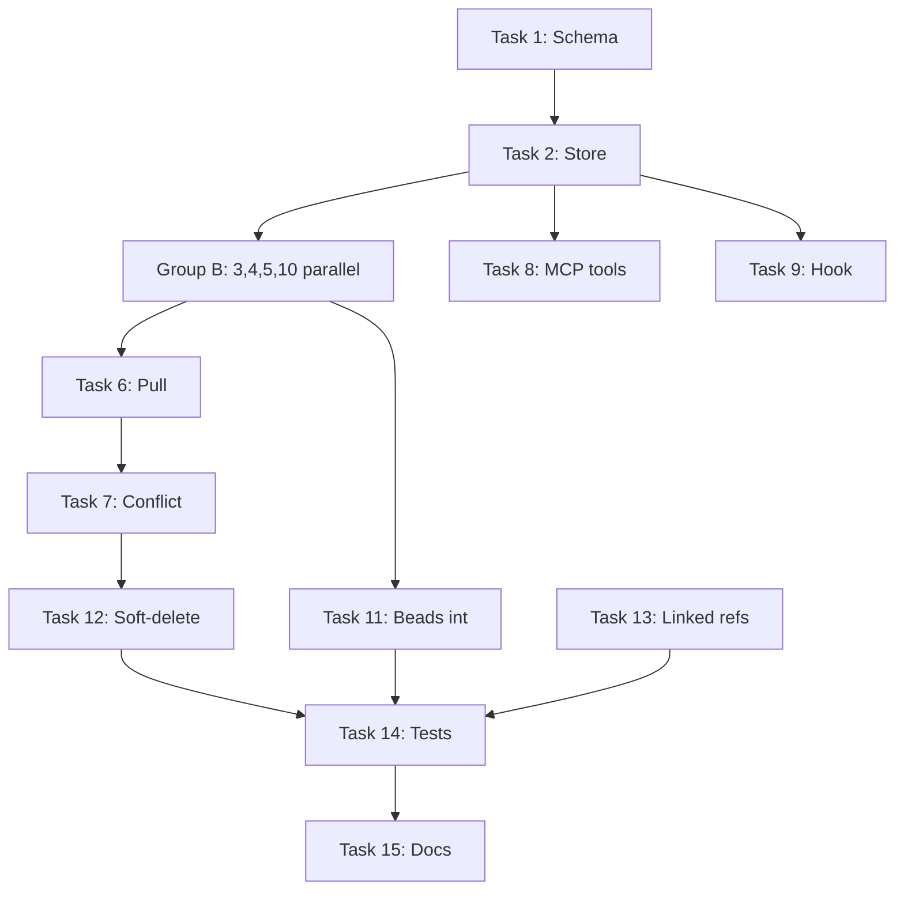

# Architecture Review: Bidirectional Sync Implementation Plan

**Reviewer:** Flux Architecture Agent
**Plan:** `/root/projects/Interverse/plugins/interkasten/docs/plans/2026-02-15-bidirectional-sync.md`
**Date:** 2026-02-16

---

## Executive Summary

The bidirectional sync plan extends a clean push-only engine with pull sync, three-way merge, and beads integration. The **good news:** the plan correctly reuses the existing WAL protocol, introduces merge/poller/beads as separate modules, and maintains agent-native design principles. The **structural concerns:** `engine.ts` is growing toward god-object territory (seven new methods), conflict handling is split between engine and merge module, and the task sequencing creates artificial serial bottlenecks that don't reflect actual dependency constraints.

**Recommended before implementation:**
1. Extract conflict orchestration into `sync/conflict-resolver.ts` (owns merge + store coordination)
2. Parallelize Tasks 4-5 (merge + poller are independent)
3. Clarify pull operation routing: does `processQueue()` fork on `op.side`, or should there be a unified `processOperation()` dispatcher?

---

## 1. Boundaries & Coupling

### 1.1 Module Responsibilities (Current)

| Module | Responsibility | Line Count | External Dependencies |
|--------|---------------|------------|----------------------|
| `engine.ts` | Push orchestration, WAL protocol, watcher coordination | 318 | NotionClient, DB, FileWatcher, SyncQueue |
| `queue.ts` | Operation deduplication, backpressure | 114 | p-queue |
| `notion-client.ts` | Rate limiting, circuit breaker, mutex, error translation | 378 | @notionhq/client, p-queue |
| `entities.ts` | Entity CRUD, soft-delete, hash management | 200 | Drizzle ORM |
| `db.ts` | Schema migrations, connection lifecycle | 118 | better-sqlite3, Drizzle |

**Observation:** Clear separation of concerns in the current codebase. `engine.ts` is already the largest file and the only one that crosses sync/store boundaries. `NotionClient` correctly owns all Notion API concerns (including circuit breaker, which is infrastructure, not business logic).

### 1.2 Proposed Module Additions

| New Module | Responsibility | Calls Into | Called By |
|------------|---------------|-----------|-----------|
| `merge.ts` | Three-way merge algorithm, conflict file formatting | node-diff3 | engine.ts (handleConflict) |
| `notion-poller.ts` | Poll Notion for changes, extract titles | NotionClient | engine.ts (pollNotionChanges) |
| `beads-sync.ts` | Call `bd` CLI, diff state, map properties | execFileSync | engine.ts (pollBeadsChanges) |
| `linked-refs.ts` | Generate T2 summary card properties | — | engine.ts (push T2 entities) |

**Observation:** Each new module owns a clear domain. `merge.ts` and `beads-sync.ts` have no database dependencies (pure transformation logic). `notion-poller.ts` depends only on `NotionClient`. This is good separation.

### 1.3 Engine.ts Growth Trajectory

**Current methods (9):**
- `start()`, `stop()`, `handleFileChange()`, `notifyFileChange()`
- `processQueue()`, `processPushOperation()`, `pushUpdate()`
- `syncFile()`, `getStatus()`

**Proposed additions (7):**
- `pollNotionChanges()` — fetch remote updates, enqueue pull ops
- `processPullOperation()` — route pull ops, fetch content, detect conflicts
- `executePull()` — WAL protocol for pull (pending → write → committed)
- `handleConflict()` — three-way merge orchestration, store conflict state
- `pollBeadsChanges()` — fetch beads issues, diff, enqueue push ops
- `findProjectDir()` — walk up to find project root for path validation
- Plus modifications to `processQueue()` to route `op.side === "notion"`

**Resulting complexity:**
- **16 methods** (up from 9)
- **~600-700 LOC** (doubled from 318)
- **Responsibilities:** file watching, queue processing, push sync, pull sync, conflict resolution, beads polling, path validation, project discovery

**Verdict:** `engine.ts` is becoming a **god object**. It owns:
- Push orchestration (current)
- Pull orchestration (new)
- Conflict resolution (new, should be separate)
- Beads integration (new, should be separate)
- Project structure knowledge (new, via `findProjectDir`)

### 1.4 Boundary Violations

#### **Issue 1: Conflict Handling Split**

The plan splits conflict concerns across two modules:

- `merge.ts` — pure algorithm (three-way merge, conflict detection)
- `engine.ts:handleConflict()` — orchestration (fetch base content, apply strategy, mark conflict in DB, write to disk, push merged result back to Notion)

**Why this is a problem:**
- `handleConflict()` is 50+ LOC (per plan snippet lines 780-831) and owns non-trivial policy:
  - Strategy selection from config
  - Base content retrieval
  - Conflict-file vs. three-way-merge branching
  - Database state mutations (`markConflict`, `clearConflict`)
  - Filesystem writes
  - Notion push of merged result
- This logic is specific to conflict resolution, not general sync orchestration
- If conflict handling needs to evolve (e.g., add a UI-based resolver, add conflict resolution hooks), we're editing `engine.ts` instead of a dedicated conflict module

**Better boundary:**
Extract `sync/conflict-resolver.ts`:
```typescript
export class ConflictResolver {
  constructor(
    private db: DB,
    private config: Config,
    private engine: SyncEngine  // For pushUpdate callback
  ) {}

  async resolve(
    entity: EntityMap,
    localContent: string,
    notionContent: string,
  ): Promise<void> {
    // All the logic currently in handleConflict
  }
}
```

Then `engine.ts:processPullOperation()` calls `conflictResolver.resolve()` instead of `this.handleConflict()`.

**Benefit:** Conflict resolution policy is now a first-class module, testable in isolation, easier to extend.

#### **Issue 2: Beads Polling in Engine**

`engine.ts:pollBeadsChanges()` calls `fetchBeadsIssues()` from `beads-sync.ts`, diffs state, and enqueues push operations. This is correct *mechanically*, but it introduces a **domain coupling**:

- `engine.ts` now knows about beads-specific state diffing logic
- If beads sync needs to handle more complex lifecycle (e.g., bidirectional beads ↔ Notion sync, not just push), we're editing engine.ts again

**Better boundary:**
Create `sync/beads-poller.ts` (analogous to `notion-poller.ts`):
```typescript
export class BeadsPoller {
  constructor(private db: DB, private projectsDir: string) {}

  async poll(): Promise<BeadsChange[]> {
    // Current pollBeadsChanges logic
  }
}
```

Then `engine.ts` calls `beadsPoller.poll()` and enqueues ops generically, without knowing beads-specific diffing logic.

**Benefit:** Beads knowledge lives in one module, not scattered across engine + beads-sync.

#### **Issue 3: Path Validation Logic in Engine**

The plan adds `findProjectDir()` to `engine.ts` (Task 6, lines 686-687). This is a **filesystem traversal utility**, not sync logic. It's called during pull to validate paths against project boundaries.

**Better boundary:**
Move to `utils/path-validation.ts`:
```typescript
export function findProjectRoot(filePath: string): string | null { ... }
export function isPathWithinProject(filePath: string, projectDir: string): boolean { ... }
```

Then `engine.ts` imports and calls these utilities.

**Benefit:** Path utilities are reusable (e.g., for CLI tools, other modules), and engine stays focused on sync orchestration.

### 1.5 Dependency Direction Violations

**Current:**
- `engine.ts` → `entities.ts`, `notion-client.ts`, `queue.ts`, `watcher.ts`, `translator.ts`
- All arrows point outward from engine (good — engine is the orchestrator)

**Proposed:**
- `engine.ts` → `merge.ts`, `notion-poller.ts`, `beads-sync.ts`, `linked-refs.ts`
- Still outward (good)

**Exception:**
- `engine.ts:handleConflict()` → `merge.ts:threeWayMerge()` → **engine callback for pushUpdate**
  - This creates a **circular dependency** if not careful
  - The plan's `handleConflict()` (line 830) calls `this.pushUpdate()` directly, which is fine
  - But if we extract `ConflictResolver`, we need to pass `pushUpdate` as a callback or accept `engine` reference
  - **Recommendation:** Pass `pushUpdate` as a callback to avoid coupling resolver back to engine

**Verdict:** Dependency direction is mostly sound, but extraction of conflict/beads logic requires careful callback design to avoid circular refs.

---

## 2. Pattern Analysis

### 2.1 Existing Patterns (To Preserve)

#### **WAL Protocol (Lines 199-265 in engine.ts)**
The plan correctly reuses the existing WAL protocol for pull operations (Task 6, lines 681-686):
1. pending
2. target_written (local file written)
3. committed (entity_map updated)
4. delete (WAL cleanup)

**Good:** This is **intentional duplication** — push and pull use the same recovery protocol. The plan doesn't try to abstract it prematurely.

#### **Circuit Breaker (notion-client.ts)**
All Notion API calls go through `NotionClient.call()`, which enforces rate limiting, backoff, and circuit breaker. The new `NotionPoller` correctly calls `this.notion.call()` (Task 5, lines 560-570).

**Good:** Infrastructure policy is centralized.

#### **Content Addressing (entities.ts:upsertBaseContent)**
Base content is stored by SHA-256 hash. Conflict handling (Task 7, lines 787-789) correctly uses `upsertBaseContent()` to store both local and notion versions for conflict state.

**Good:** No duplication of content storage logic.

### 2.2 New Patterns Introduced

#### **Polling Intervals (Task 6, lines 692-702)**
The plan adds two intervals in `index.ts`:
1. Notion polling (60s default)
2. Beads polling (piggybacked or separate)

**Pattern:** Time-based polling is the simplest bidirectional sync strategy (no webhooks yet). This is pragmatic for MVP.

**Risk:** Two separate intervals risk overlapping work. If Notion poll takes >60s, the next poll starts before the first finishes.

**Mitigation:** The plan doesn't show explicit overlap protection. `SyncQueue` deduplicates by entity key, so overlapping polls won't double-process the same page, but the poll itself might run twice in parallel.

**Recommendation:** Wrap each poll in a mutex or skip if previous poll is still running:
```typescript
let pollInProgress = false;
const pollInterval = setInterval(async () => {
  if (pollInProgress) return;
  pollInProgress = true;
  try {
    await syncEngine.pollNotionChanges();
  } finally {
    pollInProgress = false;
  }
}, 60000);
```

#### **Three-Way Merge Fallback (Task 4, lines 381-394)**
When `conflictFallback` is `"three-way-merge"` (the default), conflicts fall back to `"local-wins"` (line 392). This is a **hidden policy decision**.

**Problem:** User sets `conflict_strategy: "three-way-merge"` in config, expecting conflicts to be preserved for manual resolution, but the merge module silently auto-resolves with local-wins.

**The plan's `handleConflict()` then re-detects conflicts** (line 809) and marks them in the DB, so the final outcome is:
1. Merge returns `hasConflicts: true`, `merged: <local-wins content>`
2. Engine writes merged to disk (line 827)
3. Engine marks conflict in DB (line 812)
4. Engine pushes merged to Notion (line 830)

**So the user gets:**
- Local file: local-wins merged content
- Notion page: local-wins merged content
- Database: conflict marked, with local/notion versions stored

**This is correct**, but the fallback-within-three-way-merge is confusing. The `conflictFallback` parameter in `threeWayMerge()` should be renamed to clarify intent:
```typescript
export function threeWayMerge(
  base: string,
  local: string,
  remote: string,
  autoResolveStrategy: "local-wins" | "notion-wins" | "none" = "none",
): MergeResult
```

And the `"conflict-file"` strategy (line 389) falls back to local-wins inside merge, which is never used because `handleConflict()` branches to conflict-file generation earlier (line 791-797).

**Recommendation:** Remove the `conflictFallback` parameter from `threeWayMerge()` — let it always return conflicts without resolution. Move resolution logic entirely to `handleConflict()`.

#### **Soft-Delete Safety (Task 12)**
Local file deletion → soft-delete entity + mark Notion page as `⚠️ Source Deleted`.
Notion page archived → soft-delete entity + leave local file intact.

**Good:** Asymmetric deletion policy prevents accidental data loss. This is the right default.

**Pattern:** Soft-delete + GC sweep (7-day TTL) is standard. No issues.

### 2.3 Anti-Patterns Detected

#### **Hardcoded Status String (Task 12, line 1197)**
```markdown
should mark Notion page as Source Deleted
```

The plan hardcodes `⚠️ Source Deleted` as a Notion status value. This **assumes the Projects database has a "Status" property with that exact option**.

**Problem:**
- Notion databases are user-configured — the status property might not exist, or might have different options
- If the property doesn't exist, the API call will fail
- This is the same mistake the plan explicitly avoids elsewhere (agent-native design, no hardcoded vocabularies)

**Recommendation:** Make deletion marker configurable:
```yaml
sync:
  deletion_marker:
    property: "Status"
    value: "⚠️ Source Deleted"
```

And validate during `interkasten_init` that the property exists, or skip the Notion update if not configured.

#### **God Object Growth (Already Discussed)**
`engine.ts` is absorbing too many responsibilities. Extract `ConflictResolver`, `BeadsPoller`, and path utils.

#### **Test Mocking Inconsistency (Task 5, lines 459-476)**
The `NotionPoller` test mocks `notion.call()` with a raw implementation (lines 462-472), which bypasses the actual `NotionClient.call()` rate limiting and circuit breaker. This is a **test smell** — tests should verify integration with the real `call()` method, not stub it out entirely.

**Better approach:** Use dependency injection to pass a `NotionClient` interface, then mock the underlying `client.databases.query()` call, not `call()` itself.

**Risk:** If `NotionPoller` ever needs to handle circuit breaker state (e.g., skip polling when circuit is open), the tests won't catch it.

---

## 3. Simplicity & YAGNI

### 3.1 Premature Abstractions

#### **Linked References Module (Task 13)**
The plan creates `sync/linked-refs.ts` for T2 summary cards. The implementation (lines 1249-1251) is:
> T2 files get a Notion page with: title (filename), Path (rich_text), Last Modified (date), Line Count (number). Page body is empty.

**This is <20 lines of code.** It doesn't need a separate module yet — it's a single function that could live in `translator.ts` or `engine.ts` as a private helper.

**YAGNI violation:** The plan anticipates "linked references" as a reusable abstraction, but there's only one consumer (T2 entity push). This is speculative.

**Recommendation:** Implement as a function in `translator.ts`:
```typescript
export function generateT2SummaryProperties(filePath: string, stats: Stats): NotionProperties { ... }
```

Extract to a module later if T2 handling grows more complex (e.g., bidirectional sync, metadata refresh).

#### **Conflict File Formatting (Task 4, lines 409-427)**
`formatConflictFile()` is a 15-line template function. It's fine to keep in `merge.ts`, but it's dead code if the user sets `conflict_strategy: "local-wins"` or `"notion-wins"`.

**Question:** Will conflict-file strategy be commonly used, or is it a rare power-user feature?

**If rare:** This is acceptable — the complexity cost is low.
**If common:** Consider making the template user-configurable (YAML template file), which adds complexity.

**Verdict:** Leave as-is for MVP, monitor usage.

### 3.2 Missing Simplifications

#### **Frontmatter Preservation (Task 6, lines 649-669)**
The plan tests frontmatter preservation (lines 650-660) but doesn't show where this logic lives. It's **not in the task implementation** (Task 6 Step 3 says "preserving frontmatter" but doesn't show code).

**Hidden complexity:** The plan assumes frontmatter regex extraction + re-injection is trivial. It's not — edge cases:
- Multiple frontmatter blocks (invalid YAML but exists in wild)
- Frontmatter in middle of file (not at top)
- TOML frontmatter (`+++`) instead of YAML (`---`)

**Recommendation:** If frontmatter preservation is a feature, it needs explicit implementation in `executePull()`. If it's out of scope for MVP, remove the test (lines 649-669) to avoid scope creep.

#### **Pagination Handling (Task 5, lines 495-521)**
The `NotionPoller` test covers pagination (lines 495-521), but the implementation (lines 559-581) correctly handles it with a `do...while` loop.

**Good:** No over-engineering here — pagination is required, implementation is minimal.

### 3.3 Unnecessary Complexity

#### **Conflict Region Metadata (Task 4, lines 329-334)**
```typescript
export interface ConflictRegion {
  baseStart: number;
  baseEnd: number;
  localContent: string;
  remoteContent: string;
}
```

The `MergeResult` returns an array of `ConflictRegion` objects with line number ranges. **This metadata is never used.** The plan's `handleConflict()` only checks `result.hasConflicts` (boolean) and `result.conflicts.length` (count).

**YAGNI:** The line number ranges are useful for a future UI-based conflict resolver, but that's not in this plan.

**Recommendation:** Simplify to:
```typescript
export interface MergeResult {
  merged: string;
  hasConflicts: boolean;
}
```

Remove `ConflictRegion` until needed.

---

## 4. Task Sequencing Analysis

### 4.1 Declared Dependency Chain

**From plan summary (line 1343):**
> 1 → 2 → 3 → 4 → 5 → 6 → 7 → 8 → 9. Tasks 10-11 (beads) are independent of 4-9 (merge) and can run in parallel after Task 2. Tasks 12-15 depend on 6+7 being complete.

**Actual dependencies:**

| Task | Depends On | Rationale |
|------|-----------|-----------|
| 1 (Schema) | — | Foundation |
| 2 (Store helpers) | 1 | Uses new columns |
| 3 (Deps) | — | Independent (npm install) |
| 4 (Merge) | 3 | Uses node-diff3 |
| 5 (Poller) | — | Uses existing NotionClient |
| 6 (Pull in engine) | 2, 5 | Uses store helpers + poller |
| 7 (Conflict handling) | 4, 6 | Uses merge + pull |
| 8 (MCP tools) | 2 | Uses store helpers |
| 9 (Hook) | 2 | Queries conflict columns |
| 10 (Beads sync) | 3 | Uses execFileSync (no npm dep, but best practice: after deps) |
| 11 (Beads integration) | 10 | Uses beads-sync module |
| 12 (Soft-delete) | 6 | Modifies engine pull logic |
| 13 (Linked refs) | — | Independent transformation logic |
| 14 (Integration tests) | 7, 11, 12 | Covers all sync features |
| 15 (Docs) | 14 | Documents shipped features |

### 4.2 Parallelization Opportunities

**The plan says:**
> Tasks 10-11 (beads) can run in parallel after Task 2.

**But also:**
> Tasks 1-9 are serial.

**This is overly conservative.** Actual parallelizable groups:

#### **Group A: Schema + Store (Sequential)**
- Task 1 → Task 2 (serial, fast: <5 min)

#### **Group B: Independent Modules (Parallel after Task 2)**
- Task 3 (Deps) — no code deps, just npm install
- Task 4 (Merge) — depends on Task 3, but can start immediately after
- Task 5 (Poller) — no deps on Tasks 1-4
- Task 10 (Beads sync) — no deps on Tasks 1-5

**These can all run in parallel after Task 2 completes.**

#### **Group C: Integration (Sequential after Group B)**
- Task 6 (Pull in engine) — needs Tasks 2, 5
- Task 7 (Conflict handling) — needs Tasks 4, 6
- Task 8 (MCP tools) — needs Task 2 (can start early)
- Task 9 (Hook) — needs Task 2 (can start early)
- Task 11 (Beads integration) — needs Task 10

#### **Group D: Polish (After C)**
- Task 12 (Soft-delete) — needs Task 6
- Task 13 (Linked refs) — independent, can run anytime
- Task 14 (Integration tests) — needs Tasks 7, 11, 12
- Task 15 (Docs) — needs Task 14

**Revised parallelization:**



**Benefit:** Tasks 3, 4, 5, 10 can run in parallel, saving ~30-60 min of developer time.

### 4.3 Task Decomposition Issues

#### **Task 6 is Too Large**
Task 6 adds **seven changes** in one commit:
1. Import NotionPoller
2. Add `poller` field
3. Add `pollNotionChanges()` method
4. Add `processPullOperation()` method
5. Add `executePull()` method
6. Add `findProjectDir()` method
7. Modify `processQueue()` to route pull ops
8. Add poll interval to `index.ts`

**Problem:** If tests fail partway through, the commit is blocked until all seven pieces work. This violates **incremental progress**.

**Better decomposition:**
- **Task 6a:** Add `processPullOperation()` stub (routes to console.log, doesn't implement)
- **Task 6b:** Implement `executePull()` (WAL protocol)
- **Task 6c:** Integrate `NotionPoller` and implement `pollNotionChanges()`
- **Task 6d:** Modify `processQueue()` to route pull ops
- **Task 6e:** Add poll interval to `index.ts`

Each subtask is <100 LOC and independently testable.

#### **Task 11 Mixes Two Concerns**
Task 11 adds:
1. Beads polling to engine
2. `interkasten_list_issues` MCP tool

**Why this is wrong:**
- MCP tool is part of the **daemon layer** (user-facing API)
- Beads polling is part of the **sync layer** (background automation)

These are separate features. If MCP tool needs changes (e.g., different output format), it shouldn't be coupled to polling logic.

**Better split:**
- **Task 11a:** Beads polling in engine
- **Task 11b:** `interkasten_list_issues` MCP tool

---

## 5. Reuse Analysis

### 5.1 Appropriate Reuse

#### **WAL Protocol (Task 6, lines 681-686)**
Pull operations reuse the existing WAL states: `pending`, `target_written`, `committed`. This is **excellent reuse** — the same crash recovery protocol works for both directions.

**No abstraction needed** — the protocol is simple (4 states), and each direction has different entity updates, so trying to unify `pushUpdate()` and `executePull()` would add complexity.

#### **Queue Deduplication (queue.ts)**
The `SyncQueue` already deduplicates by `(side, entityKey)` (lines 46-56). Pull operations use `side: "notion"`, push uses `side: "local"`. This **just works** without modification.

**Good design:** The queue was built with bidirectional in mind (the `OperationSide` enum already includes `"notion"`).

#### **Content Hashing (entities.ts)**
All hash comparisons use `hashContent(normalizeMarkdown(content))` (lines 171, 244, 294). This is reused in pull sync for conflict detection.

**No duplication.**

### 5.2 Missed Reuse Opportunities

#### **Path Validation (Task 6, lines 625-647)**
The plan tests path validation logic (traversal sequences, absolute paths). This is **generic filesystem security**, not specific to interkasten.

**Missed reuse:** Node.js has `path.resolve()` and `path.relative()` built-in. The plan's tests (lines 625-647) verify:
```typescript
const resolved = resolve(projectDir, malicious);
expect(resolved.startsWith(projectDir)).toBe(false);
```

**This is already correct usage of `path.resolve()`** — no custom code needed. The plan implies a custom `findProjectDir()` utility, but the tests don't show what it does beyond `resolve()`.

**Recommendation:** Use `path.resolve()` + `startsWith()` check directly in `executePull()`. Don't create a wrapper unless it adds business logic (e.g., walking up to `.git`/`.beads`).

#### **Soft-Delete Logic (Task 12)**
The plan adds soft-delete for local file removal and Notion page archival. But `entities.ts` already has `softDeleteEntity()` (lines 96-104). The plan should **reuse this** instead of reimplementing.

**Good:** The plan doesn't show reimplementation, so likely reuses correctly. Verify during implementation.

---

## 6. Design Recommendations

### 6.1 MUST Fix Before Implementation

#### **1. Extract Conflict Resolver**
**Why:** Prevents engine from becoming a 700-line god object.

**How:** Create `sync/conflict-resolver.ts` with:
```typescript
export class ConflictResolver {
  constructor(
    private db: DB,
    private config: Config,
    private pushCallback: (entityId: number, notionId: string, content: string, hash: string) => Promise<void>
  ) {}

  async resolve(entity: EntityMap, localContent: string, notionContent: string): Promise<void> {
    // Current handleConflict logic
  }
}
```

**Integration:** `engine.ts` creates `ConflictResolver` in constructor, calls `resolver.resolve()` from `processPullOperation()`.

**Benefit:** Conflict resolution is a 50-line module, tested independently, easy to extend (e.g., add webhook notification, custom merge strategies).

#### **2. Clarify Merge Fallback Semantics**
**Why:** The `conflictFallback` parameter in `threeWayMerge()` is confusing — it's used for two different purposes (auto-resolution and strategy selection).

**How:** Simplify `threeWayMerge()` to always return conflicts without auto-resolution. Move resolution to `ConflictResolver`.

**Change:**
```typescript
// Before (confusing):
threeWayMerge(base, local, remote, "local-wins")  // Resolves inside merge

// After (clear):
const result = threeWayMerge(base, local, remote);
if (result.hasConflicts) {
  const resolved = applyResolutionStrategy(result, strategy);
  // ...
}
```

#### **3. Parallelize Tasks 3-5, 10**
**Why:** These tasks are independent and can save 30-60 min of dev time.

**How:** Update plan summary (line 1343) to say:
> Group A: 1 → 2 (serial). Group B: 3, 4, 5, 10 (parallel after 2). Group C: 6 → 7 (serial after B). ...

### 6.2 SHOULD Fix (Improves Maintainability)

#### **4. Extract Beads Poller**
**Why:** Keeps beads domain knowledge in one module, not split between `beads-sync.ts` and `engine.ts`.

**How:** Create `sync/beads-poller.ts` with `poll()` method that returns `BeadsChange[]`. Engine calls it generically.

#### **5. Add Poll Overlap Protection**
**Why:** Prevents overlapping poll intervals if Notion API is slow.

**How:** Add a `pollInProgress` flag in `index.ts` (see §2.2 example).

#### **6. Decompose Task 6**
**Why:** 8 changes in one task is too large for TDD incremental progress.

**How:** Split into subtasks 6a-6e (see §4.3).

#### **7. Simplify ConflictRegion**
**Why:** Line number metadata is unused.

**How:** Remove `ConflictRegion` interface, return `MergeResult` with only `merged`, `hasConflicts`.

### 6.3 COULD Fix (Nice-to-Have)

#### **8. Defer Linked Refs Module**
**Why:** <20 LOC doesn't justify a separate module yet.

**How:** Implement as a function in `translator.ts`, extract later if T2 handling grows.

#### **9. Make Deletion Marker Configurable**
**Why:** Avoids hardcoded Notion property assumption.

**How:** Add `sync.deletion_marker` to config schema, validate during init.

---

## 7. Pattern Compliance

### 7.1 Agent-Native Design ✅

The plan maintains the existing agent-native principles:
- No hardcoded tier classification (T1/T2 logic stays in gather_signals)
- No hardcoded tag vocabulary (user specifies tags via MCP tool)
- Tools return raw data (conflicts list, sync log), agent interprets

**Exception:** The deletion marker (`⚠️ Source Deleted`) is hardcoded. Fix per §6.3.9.

### 7.2 MCP Tool Patterns ✅

New tools follow existing conventions:
- `interkasten_conflicts` — returns JSON list, no side effects
- `interkasten_sync` — extended with `direction` param (backwards compatible)

**Good:** No breaking changes to existing tools.

### 7.3 Testing Strategy ✅

Each task has:
1. Write failing tests
2. Implement
3. Verify tests pass
4. Commit

**Good:** TDD is enforced. All new modules have unit tests. Integration tests cover end-to-end flows.

**Missing:** No performance tests for polling (e.g., "poll 1000 pages in <10s"). This is acceptable for MVP.

---

## 8. Critical Path Issues

### 8.1 Missing Error Handling

#### **Pull Operation Path Validation (Task 6)**
The plan tests path validation (lines 625-647) but doesn't show **what happens on validation failure**.

**Scenario:** Malicious Notion page sets `Path` property to `../../../etc/passwd`. Pull operation resolves this, detects traversal, then... what?

**Options:**
1. **Skip the file** (log error, mark entity as failed)
2. **Soft-delete the entity** (treat as corrupt)
3. **Crash** (fail-safe)

**The plan doesn't specify.** This is a **security boundary** and needs explicit policy.

**Recommendation:** Skip + log error. Add to `executePull()`:
```typescript
const resolvedPath = resolve(projectDir, entity.localPath);
if (!resolvedPath.startsWith(projectDir)) {
  appendSyncLog(this.db, {
    entityMapId: entity.id,
    operation: "error",
    direction: "notion_to_local",
    detail: { error: "Path traversal attempt blocked", path: entity.localPath },
  });
  return;
}
```

#### **Poller Pagination Timeout**
`NotionPoller` has a `do...while` loop for pagination (lines 559-581). **No timeout.** If Notion returns `has_more: true` forever, the loop never exits.

**Recommendation:** Add a page limit:
```typescript
let pageCount = 0;
const MAX_PAGES = 100;
do {
  // ... query ...
  if (++pageCount > MAX_PAGES) {
    throw new Error("Pagination limit exceeded");
  }
} while (cursor);
```

### 8.2 Notion API Schema Assumptions

#### **Poller Title Extraction (Task 5, lines 586-593)**
The `extractTitle()` method checks four property names: `Name`, `name`, `Title`, `title`.

**Problem:** If the database has a different title property (e.g., `Doc Name`), polling returns `"Untitled"` for every page.

**This is acceptable for MVP** (user can rename property in Notion), but it's a **silent failure mode** — pages appear in conflict list as "Untitled" with no hint about the root cause.

**Recommendation:** Log a warning if title extraction fails:
```typescript
if (!nameCol?.title?.[0]?.plain_text) {
  console.warn(`Page ${page.id} has no recognized title property (tried: Name, Title)`);
  return "Untitled";
}
```

#### **Deletion Marker (Task 12)**
Already discussed in §2.3. **Must** make configurable or skip if property doesn't exist.

---

## 9. Structural Debt Forecast

### 9.1 Engine Complexity Trajectory

**Current:** 318 LOC, 9 methods
**After this plan:** ~650 LOC, 16 methods
**After webhooks (v0.5.x):** ~800+ LOC, 20+ methods (add webhook handlers, signature validation, retry logic)

**Recommendation:** Refactor now, before webhooks. Extract:
1. `ConflictResolver` (50 LOC)
2. `BeadsPoller` (40 LOC)
3. Path utils (20 LOC)

**Resulting engine:** ~540 LOC, 13 methods (still large, but focused on orchestration).

### 9.2 Test Maintenance

**Current tests:** 79 passing (per CLAUDE.md)
**After this plan:** ~120 tests (15 tasks × ~3 tests each + 6 integration tests)

**Test coverage by layer:**
- Store: excellent (schema, helpers, WAL, entities)
- Sync: good (queue, translator, poller, merge)
- Daemon: sparse (only tool registration, not full tool logic)

**Missing:** End-to-end MCP tool tests. The plan only tests store/sync layers, not the MCP tool handlers in `daemon/tools/`.

**Recommendation:** Add integration tests for `interkasten_conflicts` and `interkasten_sync` with `direction` param (Task 14).

---

## 10. Final Recommendations

### 10.1 Before Starting Implementation

1. **Extract `ConflictResolver`** — Don't wait until engine is 700 LOC
2. **Clarify path validation error handling** — Security boundary needs explicit policy
3. **Simplify merge fallback** — Remove `conflictFallback` param, move resolution to resolver
4. **Parallelize tasks** — Update plan to allow 3, 4, 5, 10 in parallel

### 10.2 During Implementation

1. **Monitor engine size** — If `processPullOperation()` grows >50 LOC, extract sub-methods
2. **Add poll overlap protection** — One-line change, prevents race conditions
3. **Log title extraction failures** — Helps debug Notion schema mismatches
4. **Add pagination timeout** — Prevents infinite loops on API bugs

### 10.3 After MVP Ships

1. **Extract beads poller** — When beads sync grows beyond push-only
2. **Make deletion marker configurable** — When users report status property mismatches
3. **Add performance tests** — When polling >100 projects
4. **Defer linked-refs module** — Revisit when T2 handling needs more features

---

## Conclusion

**The plan is structurally sound** with one major fix required: **extract conflict resolution from engine.ts**. The module boundaries are mostly clean, the WAL reuse is excellent, and the task sequencing is conservative but safe. The main risks are:

1. **God object growth** (600+ LOC engine) — Fix now via extraction
2. **Missing error policies** (path validation, pagination timeout) — Add explicit handling
3. **Hardcoded Notion schema assumptions** (deletion marker, title property) — Make configurable or log warnings

With the conflict resolver extraction, this plan will scale cleanly to webhooks (v0.5.x) and eventual multi-project coordination (v0.6.x). Without it, engine.ts becomes the bottleneck for all future sync features.

**Recommendation:** Proceed with implementation after applying §6.1 (MUST fixes). The remaining issues can be addressed during code review or as follow-up refactors.
